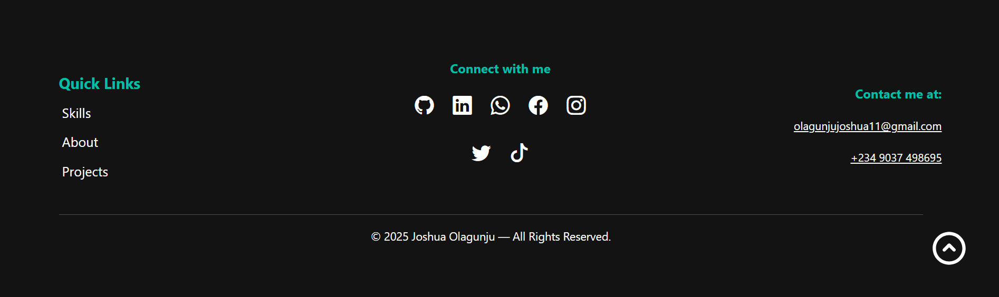
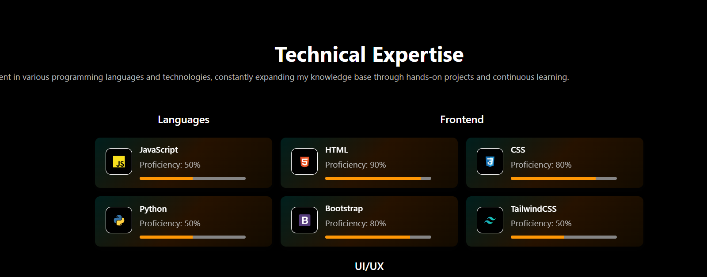
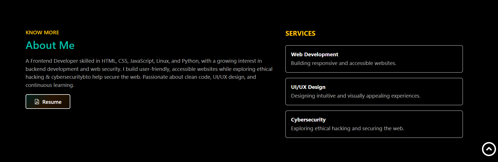

# 💼 My Portfolio Website

Welcome to my portfolio! This project showcases my skills and growth as a front-end web developer. It includes selected projects that demonstrate my ability to create responsive, user-friendly interfaces using modern web technologies.

---

## 📌 Table of Contents
- [Introduction](#introduction)
- [Technologies Used](#technologies-used)
- [Features](#features)
- [How to View](#how-to-view)
- [Challenges Faced](#challenges-faced)
- [Lessons Learned](#lessons-learned)
- [Contact](#contact)
- [License](#license)

---

## 👋 Introduction

Hi, I'm **Joshua Olagunju** — a passionate front-end developer who enjoys building clean, interactive, and responsive web experiences.

This portfolio serves as a central hub where:
- You can explore **projects I've built** using HTML, CSS, JavaScript, and Bootstrap.
- You’ll find a **gallery** of project previews.
- You can learn more about my approach to **UI/UX design** and front-end development.

Whether you're a recruiter, a collaborator, or just curious, this is where you can get a snapshot of what I can do.

---

## 🛠️ Technologies Used

- **HTML** – Markup for structuring content.
- **CSS** – Styling and responsive design.
- **JavaScript** – Adding interactivity and dynamic behavior.
- **Bootstrap** – Fast, mobile-first responsive layout and components.
- **Visual Studio Code** – Code editor used for development.

---

## ✨ Features

- **Responsive Design**: Fully optimized for mobile, tablet, and desktop devices.
- **Interactive Elements**: Dropdown menus, buttons, and other dynamic components powered by JavaScript and Bootstrap.
- **Project Gallery**: A dedicated section showcasing my best projects with direct links to live sites and code.
- **Clean UI/UX**: Simple, readable layout focused on user experience and visual clarity.
- **Contact Section**: Easy ways to reach out via email, LinkedIn, or GitHub.

---

## 🖼️ Portfolio Preview





---

## 🔍 How to View

### 🔗 [Live Demo](https://joshua-olagunju.github.io/My-portfolio/)

### 📦 Run Locally

To view or run this project locally:

```bash
# Clone the repository
git clone https://github.com/Joshua-olagunju/My-portfolio.git
```

# Navigate into the project directory
```bash
cd My-portfolio
```

# Open the index.html file in your browser
No additional setup is needed to view this portfolio locally.

## ⚙️ Challenges Faced

- Ensuring the portfolio was fully responsive across all devices required extensive testing and adjustments, especially with media queries and layout spacing.
- Aligning elements using CSS and Bootstrap was tricky at first, and I had to rework some sections multiple times to get the UI/UX right.
- I also faced challenges working with `<div>` elements — managing their positioning and nesting properly took some trial and error, but I became stronger and more confident as I figured it out.

## 🎯 Lessons Learned

- I improved my understanding of responsive design and layout structure using CSS and Bootstrap.
- I learned how to effectively use Git from the command line interface (CLI) for version control and project collaboration.
- I developed better critical thinking and problem-solving skills during the development process.
- I also became more confident using Bootstrap components and grid system to speed up my design workflow.
- Lastly, I learned how to organize and present my work clearly using GitHub README files, making my projects more professional and accessible.

## 📞 Contact
Feel free to get in touch with me!

Email: olagunjujoshua11@gmail.com

LinkedIn: https://www.linkedin.com/in/joshuaolagunju/

GitHub: [https://github.com/Joshua-olagunju](https://github.com/Joshua-olagunju)

I look forward to hearing from you!

## 🧾 License
© 2025 Joshua Olagunju. All rights reserved.

This repository and its contents are proprietary. No part of this code or content
may be copied, modified, or redistributed without prior written permission from
Joshua Olagunju.


